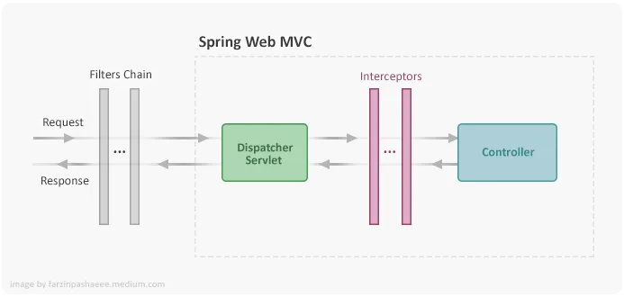

# api-request-response-log-using-interceptor

This project demonstrates to log HTTP request and response in log file
Spring Boot Interceptors are useful tools for intercepting the HTTP request/response process.
We can get the Request Body data using RequestBodyAdviceAdapter for POST/PUT requests. 
and  use HandlerInterceptorAdapter for GET/Delete calls

Sample postman collection is added with this repository.

# Details
Spring Boot Interceptors are useful tools for intercepting the HTTP request process. 
The concept is similar to AOP pointcuts and you can have them easily plugged and unplugged from the HTTP request process flow.

Basically, Interceptor is similar to a Servlet Filter, but in contrast to the latter, It is located after DispatcherServlet and as a result, related HandlerInterceptor class configured inside the application context. Filters are known to be more powerful, they are allowed to exchange the request and response objects that are handed down the chain whereas, Interceptors are just allowed to add some customer custom pre-processing, option of prohibiting the execution, and also custom post-processing.

